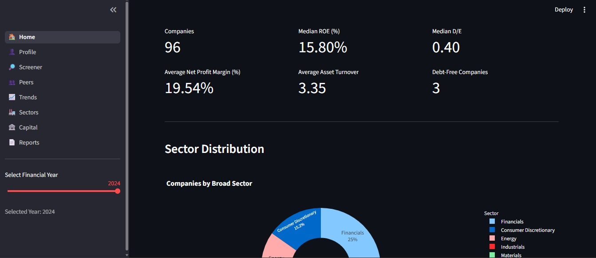
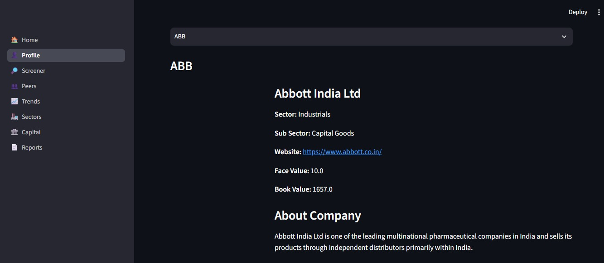
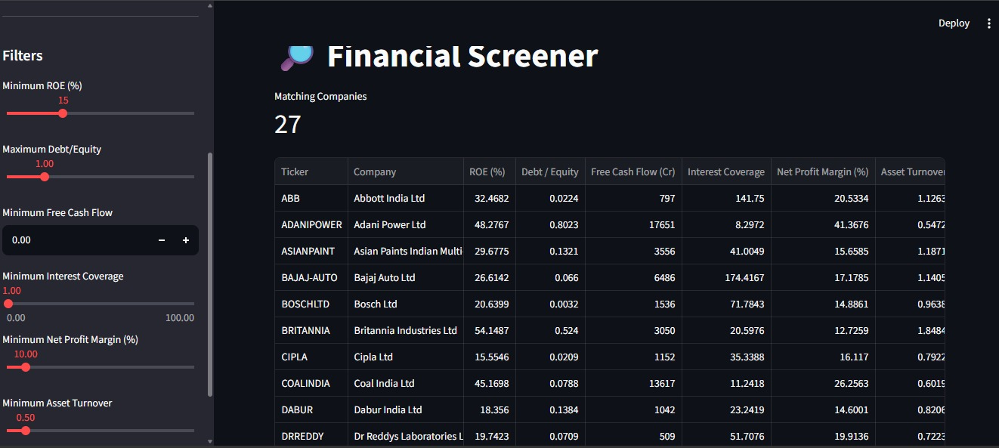
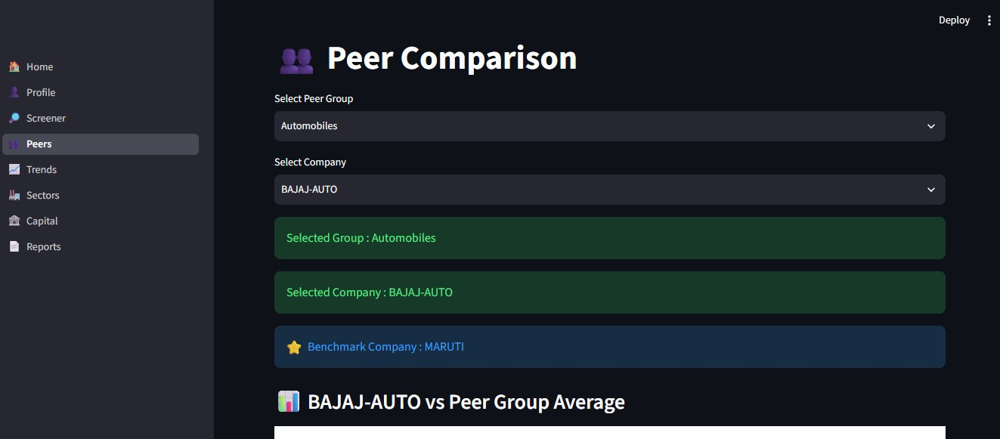
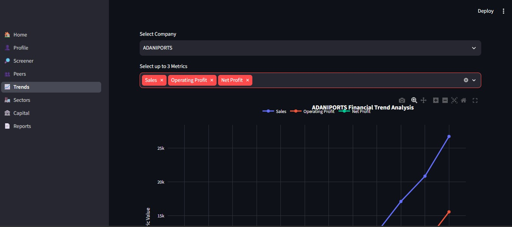
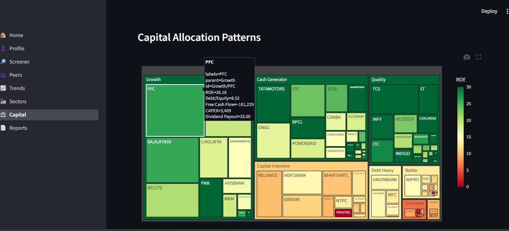
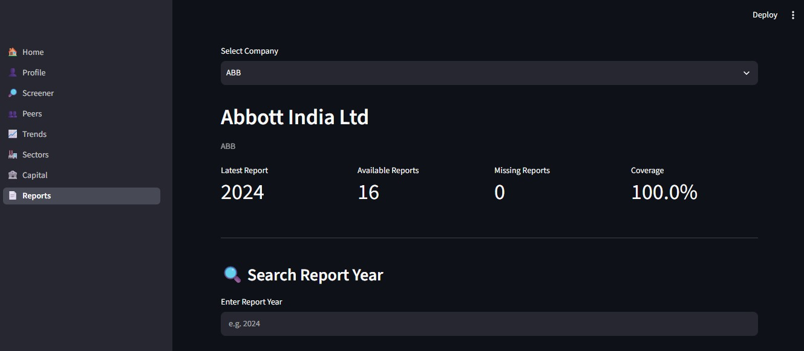

# 📊 N100 Financial Intelligence


An end-to-end financial analytics platform for **Nifty 100 companies** built using **Python, SQLite, Streamlit, Plotly, and ReportLab**.

## 🚀 Highlights

- 📈 Analyze **92 Nifty 100 companies**
- 📊 Interactive **8-page Streamlit Dashboard**
- 📄 Auto-generated Company & Sector PDF Reports
- 🤖 NLP-powered Financial Pros & Cons Generator
- 💰 Valuation, Cash Flow & Capital Allocation Intelligence
- ✅ 61/61 Automated Tests Passing


A comprehensive financial analytics platform for **Nifty 100 companies** built using **Python, SQLite, Streamlit, and Plotly**. The project performs ETL, financial ratio analysis, valuation, peer comparison, stock screening, and interactive dashboard visualization.
 


A comprehensive Financial Analytics Platform for **Nifty 100 companies** built using **Python, SQLite, Streamlit, and Plotly**. The project performs ETL, financial ratio analysis, valuation, peer comparison, stock screening, and interactive dashboard visualization.


---

# 🚀 Live Demo

🌐 **https://n100-financial-intelligence-tnkkhqyvgwljdtvfm8reuh.streamlit.app/**

# 📂 GitHub Repository

https://github.com/Arunmozhi1997/N100-Financial-Intelligence

---

# 📑 Table of Contents

- Overview
- Features
- Tech Stack
- Project Architecture
- Dataset
- Project Structure
- Installation
- Usage
- Dashboard Pages
- Screenshots
- Testing
- Generated Reports
- Stock Screeners
- Project Highlights
- Skills Demonstrated
- Future Improvements
- Author

---

# 📌 Overview

N100 Financial Intelligence is an end-to-end financial analytics platform developed for Nifty 100 companies.

The application automates:

- Financial data processing
- Financial ratio calculation
- Company profiling
- Stock screening
- Peer comparison
- Trend analysis
- Capital allocation visualization
- Annual report exploration

The final output is an interactive Streamlit dashboard deployed online.

---

# ✨ Features

## 🔄 ETL Pipeline

- Automated Data Ingestion
- Data Cleaning & Validation
- SQLite Database Loading
- Financial Statement Processing

---

## 📈 Financial Analytics

- Financial Ratio Engine
- CAGR Analysis
- Valuation Analysis
- Cash Flow Intelligence
- Capital Allocation Analysis
- Growth Analysis
- Quality Score Calculation

---

## 🤖 NLP Engine

- Financial Text Parser
- Automatic Pros & Cons Generation
- Confidence Scoring
- Rule-Based Financial Insights

---

## 🔎 Financial Screener

- Multi-factor Screening
- Quality Compounders
- Value Picks
- Dividend Champions
- Growth Accelerators
- CSV Export

---

## 🤝 Peer Comparison

- Radar Charts
- Company Comparison
- Financial Metric Comparison
- Industry Benchmarking

---

## 📄 Report Generation

- Company Tearsheets (PDF)
- Sector Reports (PDF)
- Portfolio Summary Report
- Financial Health Dashboard

---

## 📊 Interactive Dashboard

- Home Dashboard
- Company Profile
- Financial Screener
- Peer Comparison
- Trend Analysis
- Capital Allocation
- Valuation
- Annual Reports

---

# 🛠 Tech Stack

| Category | Technologies |
|----------|--------------|
| Language | Python 3.11 |
| Database | SQLite |
| Data Processing | Pandas, NumPy |
| Dashboard | Streamlit |
| Visualization | Plotly |
| Excel | OpenPyXL |
| Testing | Pytest |
| Code Quality | Ruff, Black |
| Version Control | Git & GitHub |

---

# 📊 Project Statistics

| Metric | Value |
|---------|------:|
| Companies Analyzed | 92 |
| Sectors Covered | 10 |
| Dashboard Pages | 8 |
| PDF Company Tearsheets | 92 |
| Sector Reports | 10 |
| Portfolio Summary | 1 |
| SQLite Database | 20+ Tables |
| Financial KPIs | 100+ |
| Automated Tests | 61 / 61 ✅ |
| Technologies Used | Python, SQLite, Streamlit, Plotly, ReportLab |

---

---

# 🏗 Project Architecture

```
Raw Financial Data
        │
        ▼
   ETL Pipeline
        │
        ▼
 SQLite Database
        │
        ▼
 Financial Analytics Engine
        │
        ▼
 Streamlit Dashboard
        │
        ▼
 Live Web Application
```

---

# 📊 Dataset

| Item | Value |
|------|-------|
| Companies | 92 |
| Market | Nifty 100 |
| Database | SQLite |
| Financial Statements | Profit & Loss, Balance Sheet, Cash Flow |
| Years | Multi-year Financial Data |

---

# 📂 Project Structure

```
N100-Financial-Intelligence
│
├── db/
│   ├── nifty100.db
│   ├── schema.sql
│   └── exploratory_queries.sql
│
├── output/
│   ├── valuation_summary.xlsx
│   ├── cashflow_intelligence.xlsx
│   ├── screener_output.xlsx
│   ├── pros_cons_generated.csv
│   ├── analysis_parsed.csv
│   └── ...
│
├── reports/
│   ├── tearsheets/
│   ├── sector/
│   └── portfolio/
│
├── src/
│   ├── analytics/
│   ├── dashboard/
│   ├── etl/
│   ├── nlp/
│   ├── reports/
│   └── screener/
│
├── tests/
│
├── requirements.txt
├── README.md
└── pytest.ini
```

---

# ⚙ Installation

Clone the repository

```bash
git clone https://github.com/Arunmozhi1997/N100-Financial-Intelligence.git
```

Go inside

```bash
cd N100-Financial-Intelligence
```

Create virtual environment

```bash
python -m venv venv
```

Activate

### Windows

```bash
venv\Scripts\activate
```

Install packages

```bash
pip install -r requirements.txt
```

---

# ▶ Usage

## Run ETL

```bash
python -m src.etl.loader
```

## Run Financial Ratio Engine

```bash
python -m src.analytics.ratio_engine
```

## Run Stock Screener

```bash
python -m src.screener.engine
```

## Run Dashboard

```bash
streamlit run src/dashboard/app.py
```

Open

```
http://localhost:8501
```

---

# 📊 Dashboard Pages

## 🏠 Home

- Market Overview
- KPI Cards
- Sector Distribution
- Top Companies

---

## 🏢 Company Profile

- Company Overview
- Financial KPIs
- Revenue Trend
- Profit Trend
- Debt Trend
- Financial Ratios
- Pros & Cons

---

## 🔎 Financial Screener

- Multi-factor Filters
- Financial Screening
- CSV Export

---

## 🤝 Peer Comparison

- Company Comparison
- Radar Chart
- Financial Metrics

---

## 📈 Trend Analysis

- Historical Trends
- Year-over-Year Growth
- Interactive Charts

---

## 🏦 Capital Allocation

- Treemap Visualization
- Capital Distribution

---

## 💰 Valuation

- Valuation Metrics
- Discount/Premium Analysis
- Financial Multiples

---

## 📄 Annual Reports

- Search by Company
- Search by Year
- Report Availability

---

# 📸 Dashboard Preview

## 🏠 Home Dashboard



---

## 🏢 Company Profile



---

## 🔎 Financial Screener



---

## 🤝 Peer Comparison



---

## 📈 Trend Analysis



---

## 🏦 Capital Allocation



---

## 💰 Valuation


---

## 📄 Annual Reports

```

---

# 🧪 Testing

Run tests

```bash
pytest
```

## Test Status

✅ 61 / 61 Tests Passed

✅ Ruff Checks Passed

✅ Black Formatting Passed

---

# 📄 Generated Reports

Automatically generated reports

- valuation_summary.xlsx
- valuation_flags.csv
- quality_compounder.xlsx
- value_pick.xlsx
- growth_accelerator.xlsx
- dividend_champion.xlsx
- debt_free_blue_chip.xlsx
- turnaround_watch.xlsx
- screener_output.xlsx

---

# 📈 Stock Screeners

- Quality Compounder
- Value Pick
- Growth Accelerator
- Dividend Champion
- Debt Free Blue Chip
- Turnaround Watch

---

# 🏆 Project Highlights

- ✅ End-to-End Financial Analytics Platform
- ✅ 92 Nifty 100 Companies Analyzed
- ✅ Automated ETL Pipeline
- ✅ SQLite Data Warehouse
- ✅ Financial Ratio Engine
- ✅ Cash Flow Intelligence Module
- ✅ NLP-based Financial Pros & Cons Generator
- ✅ Capital Allocation Analysis
- ✅ Interactive 8-Page Streamlit Dashboard
- ✅ 92 Company Tearsheets (PDF)
- ✅ 10 Sector Reports (PDF)
- ✅ Portfolio Summary Report
- ✅ 61 / 61 Automated Tests Passed
- ✅ Live Cloud Deployment on Streamlit

---

# 💡 Skills Demonstrated

### Programming

- Python
- SQL
- Object-Oriented Programming

### Data Engineering

- ETL Pipeline
- Data Cleaning
- Data Validation
- SQLite Database Design

### Financial Analytics

- Financial Statement Analysis
- Ratio Analysis
- CAGR Analysis
- Valuation
- Cash Flow Intelligence
- Capital Allocation Analysis

### Data Visualization

- Streamlit
- Plotly
- Interactive Dashboards
- ReportLab PDF Reports

### Software Engineering

- Git & GitHub
- Automated Testing (Pytest)
- Code Formatting (Black)
- Linting (Ruff)

### NLP

- Regex Parsing
- Rule-Based Text Generation
- Confidence Scoring

---

# 🔮 Future Roadmap

- 📈 Real-Time Stock Price Integration
- 🤖 AI-powered Financial Insights using LLMs
- 📊 Portfolio Performance Tracker
- 📉 Risk & Volatility Analytics
- 🔐 User Authentication
- 🌍 REST API
- 🐳 Docker Deployment
- ⚙️ CI/CD Pipeline with GitHub Actions
- ☁️ Cloud Database Integration

---

# 👨‍💻 Author

## Arunmozhi M

**Data Analyst | Financial Analytics | Python Developer | SQL | Streamlit | Machine Learning**

### 🔗 LinkedIn

https://www.linkedin.com/in/arunmozhi-muthu-65a29037b/

### 💻 GitHub

https://github.com/Arunmozhi1997

---

⭐ If you found this project useful, consider giving it a **Star** on GitHub!

